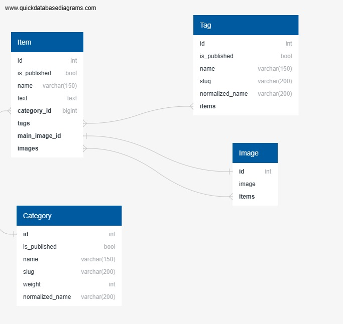

# Django project
[](https://gitlab.crja72.ru/django_2023/students/55364-v.klimenko.2137-gmail.com-47535/-/commits/main) 

## Installation
1. Clone the repository:
    ```
    git clone git@gitlab.crja72.ru:django_2023/students/55364-v.klimenko.2137-gmail.com-47535.git
    ```
2. Navigate to the project directory:
    ```
    cd lyceum
    ```
3. Create a virtual environment:
    ```
    python -m venv venv
    ```
4. Activate the virtual environment:
    ```
    source venv/bin/activate
    ```
5. Install the project dependencies:
    ```
    pip install -r requirements/prod.txt
    ```
6. Set a .env:
   ```
    Create a new file in the root directory of your Django project called ".env".
    Open the .env file in your text editor.
    Add your DJANGO_SECRET_KEY, DJANGO_ALLOWED_HOSTS and set DJANGO_DEBUG mode to a Django project.
    The DJANGO_SECRET_KEY is a string of random characters that is used to secure your Django application.
    DJANGO_DEBUG is a boolean variable that determines whether or not Django is running in debug mode.
    DJANGO_ALLOWED_HOSTS is a list of strings that specifies which hostnames are allowed to access the application.
   ```
7. Run the Django development server:
    ```
    python manage.py runserver
    ```
8. Open your web browser and go to http://localhost:8000/ to view the project.


## Creating translation
1. Create "locale" directory
2. Add directory with yor language code
3. run ```django-admin makemessages -a```
4. Add 'msgid' and 'msgstr'
5. run ```python manage.py compilemessages```

# Database ER
